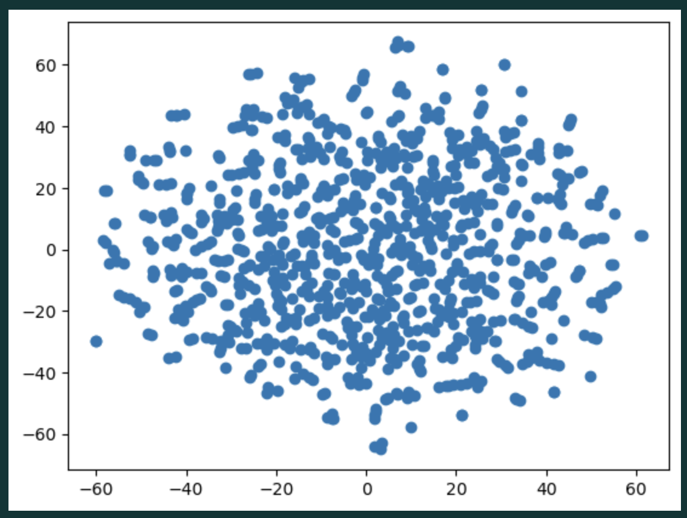
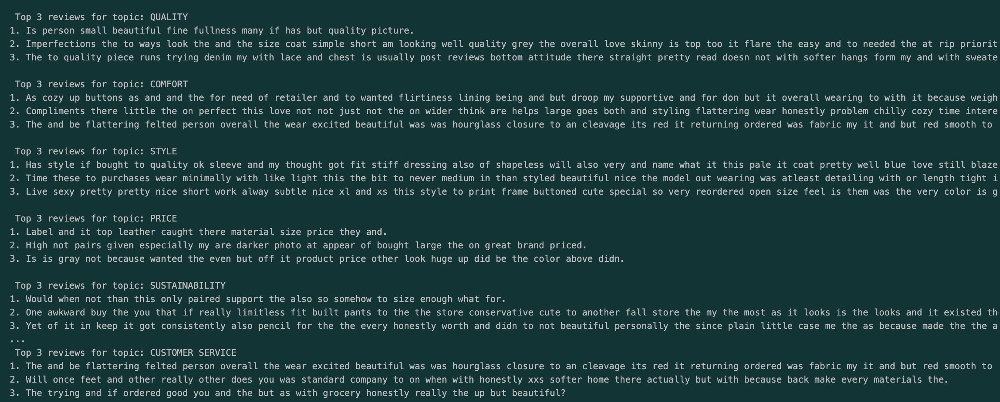

# Recommendations with Text Embeddings (Synthetic Data)

**Author**  
Sam Ginzburg
samginzee@gmail.com  

---

## Business Problem and Motivation

Unstructured customer reviews contain rich qualitative insights, but they are difficult to analyze at scale using traditional rule-based or keyword approaches. Modern embedding models allow text to be transformed into numerical vectors that preserve semantic meaning, enabling similarity search, clustering, and recommendation-style retrieval.

The goal of this project is to demonstrate how **text embeddings** can be used to:
- Identify latent themes in customer reviews
- Group semantically similar feedback
- Retrieve representative reviews for high-level business topics (e.g., quality, comfort, price)

This approach is directly applicable to product analytics, customer experience analysis, and recommendation systems.

---

## Data Source

The original project was inspired by a **guided learning exercise on DataCamp** using an e-commerce women’s clothing reviews dataset.

To respect licensing and redistribution constraints, this repository **does not include the original dataset**. Instead, a **synthetic dataset** was generated to mirror:
- Column structure
- Data types
- Missingness patterns
- Statistical distributions
- Categorical hierarchies (Division → Department → Class)

**Synthetic dataset used in this repository:**  
data/womens_clothing_synthetic.csv

The synthetic text data is newly generated and does not contain verbatim or near-duplicate copies of the original reviews.

---

## Methods and Skills Demonstrated

This project demonstrates the following technical skills:

- **Natural Language Processing (NLP)**
  - Text embedding generation using OpenAI embedding models
  - Semantic similarity via cosine distance
- **Data Engineering & Reproducibility**
  - Synthetic data generation for safe public sharing
  - Environment variable management for API keys
- **Machine Learning & Geometry**
  - Vector similarity search
  - Dimensionality reduction using t-SNE for visualization
- **Python & Data Science Tooling**
  - pandas, NumPy
  - scikit-learn
  - modular, readable notebook structure
- **Responsible API Usage**
  - Secure handling of API keys via `.env`
  - Clear documentation for local execution

---

## Methodology Overview

1. **Text Embedding**
   - Customer review text is converted into high-dimensional embedding vectors using a transformer-based embedding model.
   - Each vector represents the semantic meaning of a review.

2. **Topic Representation**
   - High-level business topics (e.g., *Quality*, *Comfort*, *Style*, *Price*) are also embedded into the same vector space.

3. **Similarity Search**
   - Cosine distance is used to measure semantic similarity between topic vectors and review vectors.
   - For each topic, the closest reviews are retrieved as representative examples.

4. **Visualization**
   - t-SNE is applied to reduce high-dimensional embeddings into two dimensions for exploratory visualization.
   - This allows inspection of clustering behavior and semantic spread.

---

## Quick Glance at Results

### Embedding Space Visualization (t-SNE)

*Each point represents a customer review embedded into semantic space and projected into two dimensions. Proximity reflects semantic similarity.*

---

### Representative Reviews by Topic

*For each predefined business topic, the three most semantically similar reviews are retrieved using cosine similarity.*

---

## How to Interpret the Results

- Reviews that appear close together in the embedding space tend to express similar sentiments or themes, even when phrased differently.
- Topic-specific nearest-neighbor retrieval surfaces reviews that best exemplify abstract concepts such as *comfort* or *quality*.
- This approach enables qualitative insights at scale without manual labeling.

While this analysis does not explain **why** certain themes emerge, it provides a powerful foundation for:
- Customer feedback summarization
- Product issue discovery
- Recommendation and personalization systems

---

## Environment Setup

To run this project locally:

1. Clone the repository
2. Install dependencies:
pip install -r requirements.txt
3. Create a `.env` file in the project root and add:
OPENAI_API_KEY=your_api_key_here
4. Open and run:
notebooks/Recommendations_Embeddings.ipynb

The `.env` file is excluded from version control.

---

## Credit

This project was inspired by a guided learning exercise on **DataCamp** and was extended with:
- Synthetic data generation
- End-to-end reproducibility
- Secure API usage
- Additional analysis and visualization

All implementation, restructuring, and extensions are original.
